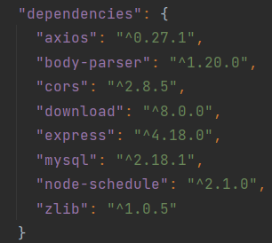
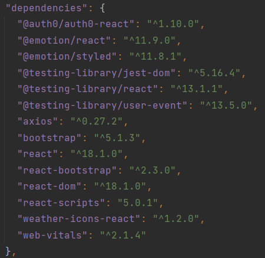
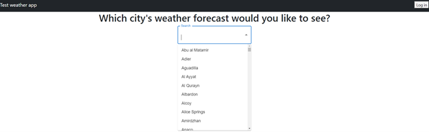
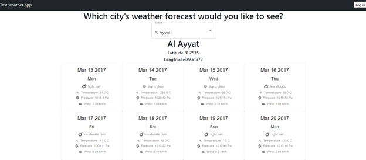
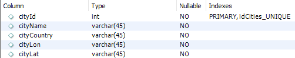
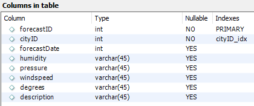

# **Overview**

This is a simple application that allows users to view weather forecasts for cities present in the database. In principle it's supposed to display current forecasts, and it's capable of doing so with small code adjustments, but due to budget and hardware limitations it only displays sample archival data from 2017. It was created by using React for the frontend, and Express + NodeJS for the backend, with MySQL serving as the database.

## **How to run it?**

To run the application the machine needs to have NodeJS and NPM installed, and the project files must be downloaded. Once these conditions have been satisfied, the following dependencies must also be installed by accessing the client and server directories and running " npm install" commands.

### Server dependencies:

### Client dependencies:

To run the application after installing all the dependencies, first access the server directory in the terminal and start the server by typing the " npm start" (or node index.js ) command, and then access the client directory in a separate terminal and type " npm start" again (or, alternatively, react-scripts start ), which will run the client in a new tab.

## **Features**

The app is divided into a client and a server.

The client allows users to search for cities present in the database and displays 16 days' worth of forecast data for a chosen city in a grid format. It also allows users to log in and out via Auth0,
but currently it does not provide any significant features that require authentication, other than displaying a log-out button instead of a log-in button if authenticated.

The server is responsible for downloading data from the external openweathermap API, and populating the database with city and forecast entries. It also handles the client's requests and provides relevant data.

The database consists of two tables – one containing cities, and one containing forecasts, with the cityID serving as a foreign key connecting the two.

## **Important notes**

Due to some problems regarding the hardware and the external API the server's features have been limited. The weather APIs available on the internet do not allow users to use their bulk download features for free, and they also put a limit on regular daily requests, which prevents the server from acquiring current forecast data. Fortunately, openweathermap provides mock-data for application testing. Unfortunately, the files are too large to handle with standard means (over 100 mb after unzipping the archive), so, the application uses a much smaller, manually extracted data sample of around 500 cities instead. Currently, database updates are triggered manually via requests, but the index.js file contains a commented-out section of code that would trigger automatic updates every day at a set hour after minimal testing and adjustments (namely, adding the deletion of expired records from the database).
